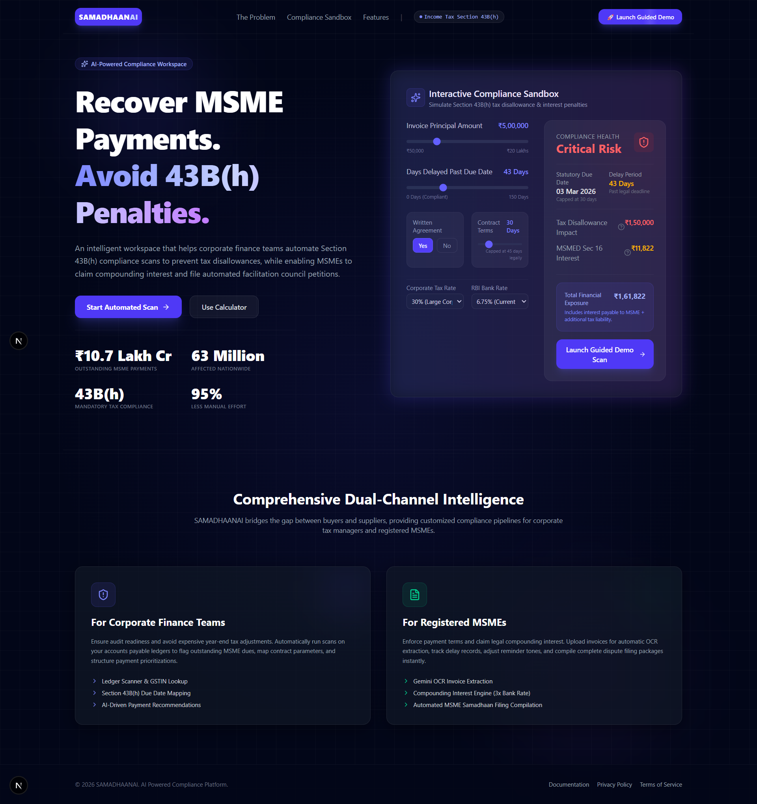
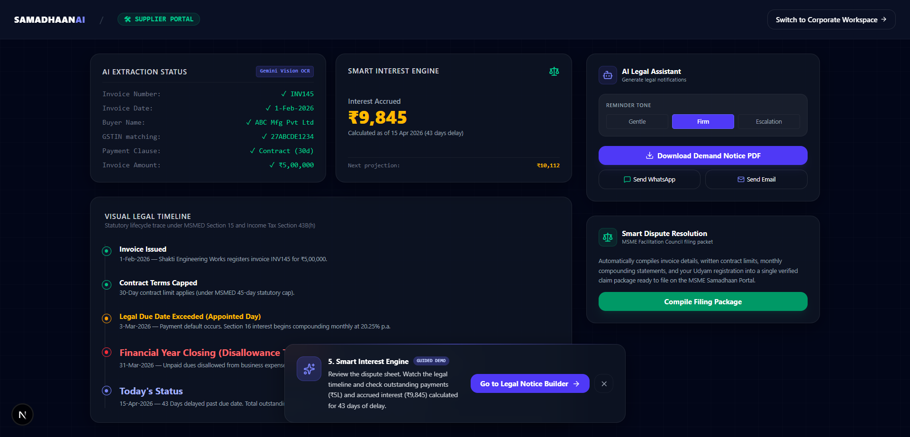
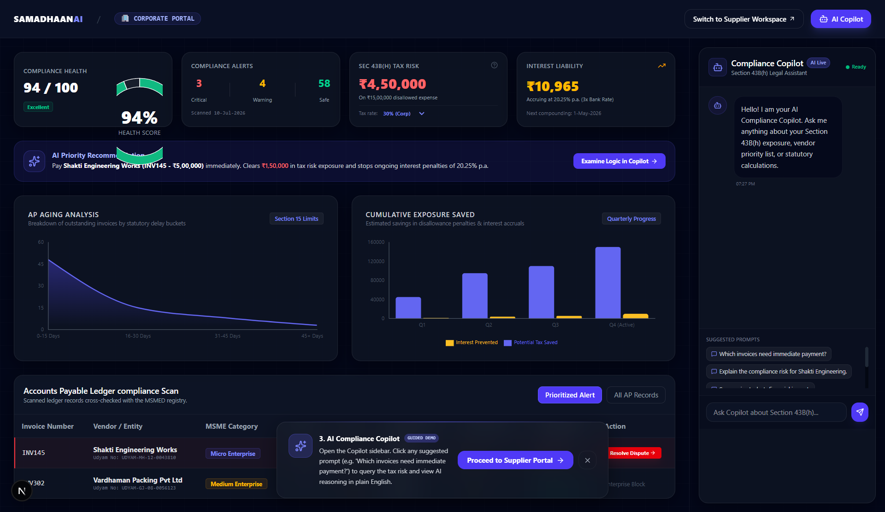
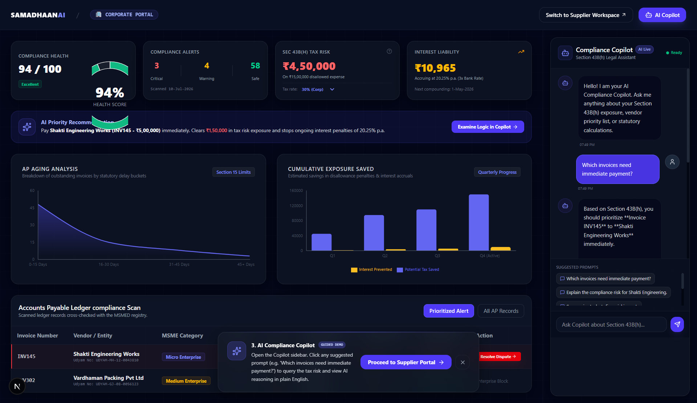

<div align="center">

# 🚀 SAMADHAANAI

### AI-Powered Compliance Intelligence Platform

Helping **MSMEs** and **Corporate Buyers** comply with **Section 43B(h)** of the Income Tax Act through AI-powered invoice analysis, compliance monitoring, and intelligent legal assistance.

<p align="center">


</p>

</div>

---

# 📖 Overview

SAMADHAANAI is an AI-powered compliance platform designed to simplify payment compliance for MSMEs and Corporate Buyers under **Section 43B(h)** of the Income Tax Act and the **MSMED Act, 2006**.

The platform combines AI, automation, analytics, and legal intelligence into a single dashboard that enables organizations to monitor compliance, analyse invoices, reduce payment delays, and generate actionable insights.

---

# ✨ Features

## 🤖 AI Compliance Copilot

- AI-powered compliance assistant
- Legal guidance
- Intelligent recommendations
- Natural language queries

---

## 📄 AI Invoice Scanner

- Upload invoices
- OCR-based extraction
- Invoice validation
- Payment due detection
- Compliance analysis

---

## 📊 Compliance Dashboard

- Compliance Score
- Due Invoice Tracking
- Risk Indicators
- Payment Analytics
- Business Metrics

---

## 📑 PDF Report Generation

- Compliance Reports
- Invoice Reports
- Downloadable PDFs

---

## 📈 Analytics

- Payment Trends
- Due Amount Analysis
- Compliance Insights
- Performance Dashboard

---

# 🖼️ Application Preview

## 🏠 Home Page

<p align="center">

</p>

---

## 👨‍💼 Supplier Dashboard

<p align="center">

</p>

---

## 🏢 Corporate Dashboard

<p align="center">

</p>

---

## 🤖 AI Copilot

<p align="center">

</p>

---

# 🏗️ Tech Stack

| Category | Technologies |
|-----------|--------------|
| Frontend | Next.js, React, TypeScript, Tailwind CSS |
| Backend | FastAPI, Python, Pydantic |
| AI | Gemini API, Prompt Engineering |
| Reports | ReportLab |
| Version Control | Git & GitHub |

---

# 📂 Project Structure

```text
SAMADHAANAI
│
├── backend
│   ├── app
│   ├── tests
│   └── requirements.txt
│
├── frontend
│   ├── src
│   ├── public
│   ├── package.json
│   └── next.config.ts
│
├── screenshots
│   ├── home.png
│   ├── supplier-dashboard.png
│   ├── corporate-dashboard.png
│   └── ai-copilot.png
│
└── README.md
```

---

# 🚀 Getting Started

## Clone Repository

```bash
git clone https://github.com/NITISH-027/SAMADHAANAI.git
cd SAMADHAANAI
```

---

## Backend

```bash
cd backend

pip install -r requirements.txt

uvicorn app.main:app --reload
```

Backend

```
http://127.0.0.1:8000
```

Swagger UI

```
http://127.0.0.1:8000/docs
```

---

## Frontend

```bash
cd frontend

npm install

npm run dev
```

Frontend

```
http://localhost:3000
```

---

# 🎯 Problem Statement

Delayed payments to MSMEs negatively impact cash flow and business operations.

SAMADHAANAI helps businesses:

- Automate invoice verification
- Track compliance
- Reduce payment delays
- Improve legal awareness
- Generate compliance reports
- Gain AI-powered business insights

---

# 🚀 Future Roadmap

- AI Legal Assistant
- WhatsApp Notifications
- Email Alerts
- GST Integration
- Cloud Deployment
- Authentication
- Multi-language Support
- OCR Improvements

---

# 👨‍💻 Developer

## Nitish Prabagaran

**AI Engineer | Python | FastAPI | LLMs | AI Automation**

🌐 Portfolio  
https://nitish-s-portfolio.vercel.app/

💼 LinkedIn  
https://www.linkedin.com/in/nitish-prabagaran/

🐙 GitHub  
https://github.com/NITISH-027

---

<div align="center">

### ⭐ If you found this project useful, consider giving it a Star!

Made with ❤️ by **Nitish Prabagaran**

</div>
